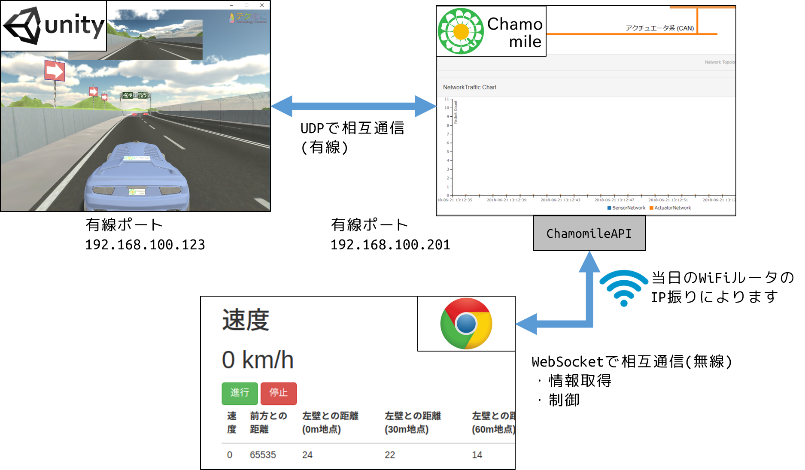

# techtech-client sample
テクのこ(社内ハッカソン)で提供するChamomile-APIの使い方のドキュメントとサンプルです。

## Chamomileとは
車載で一般的に使われるネットワークプロトコルであるCANを取得して表示したり、複雑なコンフィグレーションなしでもCANのフレームを送受信するなど、開発のサポートのために有志によって作られたツールです。
最近では、デモの説明を補助するために視覚的な表示を取り入れるなどの改善を行っています。

## Chamomile-APIとは
車載の事を知らない人でも車内の情報を簡単に活用できるようにAPIにしました。
Websocketで通信することでリアルタイムに車両の情報を取得できます。

## 使用している技術についての説明
### Websocket
双方向通信を低コストで実現するための仕組み。通常のHTTP(S)では通信のたびにヘッダを付与してRequest/Responseが発生しますが、Websocketでは最初に一度コネクションを確立するとリアルタイムでデータの送受信ができます。
### STOMP

### 取得できる情報
以下の項目を取得することができます。
また取得した情報に基づいて制御を行うことも可能です。

|項目   | 内容|範囲|
|:---|:---|:---|
|車速  |  車の時速|0 - 115|
|壁との距離  |  車と左壁および右壁との距離(0,30,60,90m先の距離を取得可能)|0 - 255|
|車との距離  |  前方車両との車との距離を取得できます|0 - 65535|

## 構成


## サンプルについて
Chamomileから取得出来る値を取得(subscribe)して、各情報をリアルタイムに表示したり、車両を走らせたり停止させたりするサンプルです。
大まかな処理はサンプル(src/index.html)にコメント付きで記載していますので確認して下さい。

### 取得について
サーバ側でエンドポイント「/topic/chamomile」に車両の取得情報を配信しています。エンドポイントとは、チャットルームの部屋番号のようなものだと思って下さい。受け取った文字列のメッセージをJSON.parseすることでJSON形式に変換して扱いやすくします。
```javascript
/* 一部抜粋 */
stompClient.subscribe('/topic/chamomile', function(message) {
  var data = JSON.parse(message.body);
```

### 制御について
車両を制御するには、エンドポイント「/chamomile/acturator」にデータを配信して下さい。サーバは受け取ったデータから、Unityへ伝えるためにUDPに変換して送信します。送信する場合はJSON.stringifyすることで文字列にして送って下さい。
```javascript
this.message.accel = 50;
this.message.steer = 100;
stompClient.send('/chamomile/actuator', {}, JSON.stringify(this.message))
```

## トラブルシューティング
