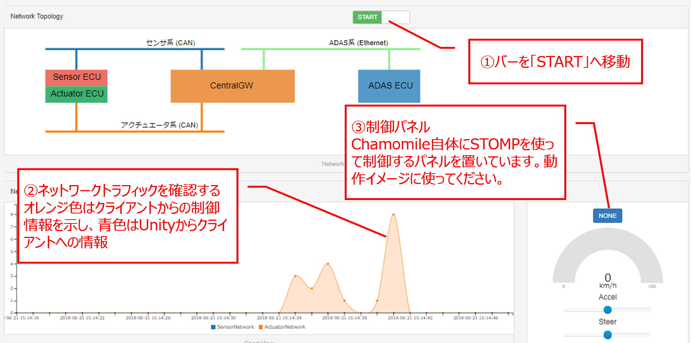

# techtech-client sample
テクのこ(社内ハッカソン)で提供するChamomile-APIの使い方のドキュメントとサンプルです。

## Chamomileとは
車載で一般的に使われるネットワークプロトコルであるCANを取得して表示したり、複雑なコンフィグレーションなしでもCANのフレームを送受信するなど、開発のサポートのために有志によって作られたツールです。
最近では、デモの説明を補助するために視覚的な表示を取り入れるなどの改善を行っています。


## Chamomile-APIとは
車載の事を知らない人でも車内の情報を簡単に活用できるようにAPIにしました。
Websocketで通信することでリアルタイムに車両の情報を取得できます。

## 使用している技術についての説明
### Websocket
双方向通信を低コストで実現するための仕組み。通常のHTTP(S)では通信のたびにヘッダを付与してRequest/Responseが発生しますが、Websocketでは最初に一度コネクションを確立すると都度Request/Responseのやり取りをしなくて済み、リアルタイムでデータの送受信ができます。
### STOMP
Simple(or Streaming) Text Orientated Messaging Protocolの略で、軽量なメッセージングプロトコルです。Websocket上で動くためSTOMP over Websocketであり、シンプルなメッセージング実現ために採用しています。

### 取得できる情報
以下の項目を取得することができます。
また取得した情報に基づいて制御を行うことも可能です。

|項目   | 内容|範囲|
|:---|:---|:---|
|車速  |  車の時速|0 - 115|
|壁との距離  |  車と左壁および右壁との距離(0,30,60,90m先の距離を取得可能)|0 - 255|
|車との距離  |  前方車両との車との距離を取得できます|0 - 65535|

### 設定できる情報
|項目   | 内容|範囲|
|:---|:---|:---|
|アクセル| アクセルを踏む強さを指定|0 - 200．100はニュートラルで、0-99はリバース、101-200はドライブ|
|ステアリング |ハンドルの切る量|0 - 200. 100はニュートラルで、0-99は左へ、101-200は右へ |

## 構成


## サンプルについて
　Chamomileから取得出来る値を取得(subscribe)して、各情報をリアルタイムに表示したり、車両を走らせたり停止させたりするサンプルです。
大まかな処理はサンプル(src/index.html)にコメント付きで記載していますので確認して下さい。
必要なデータの取得や制御方法については重要な部分になるため、以下に説明します。


## 取得について
　サーバ側でエンドポイント「/topic/chamomile」に車両の取得情報を配信しています。エンドポイントとは、チャットルームの部屋番号のようなものだと思って下さい。受け取った文字列のメッセージをJSON.parseすることでJSON形式に変換して扱いやすくします。
サーバサイドはsockjsを利用することを前提に実装してあります。
各言語からの接続方法は公式サイトを参考にしてください。
[https://github.com/sockjs/sockjs-client](https://github.com/sockjs/sockjs-client)

```javascript
/* 一部抜粋 */
var url = "http://<IP address>:8089/endpoint"
var sock = new SockJS(url); // Chamomileのエンドポイントに接続
var stompClient = Stomp.over(sock); // stomp(WebSocket)に接続
stompClient.subscribe('/topic/chamomile', function(message) { // topic/chamomileを購読
 var data = JSON.parse(message.body);
```

　サンプル(src/index.html)の/topic/chamomileをSubcribeした時のParse結果をChromeの開発者画面のコンソールで表示したものです。このようにJSON形式で取得できるので必要な物を取得して制御に役立てたり、他のサービスとの連携に使用することが出来ます。


## 取得できるデータについて

データは車載の通信で一般的に使われるCANという通信方式のデータ構造を模したものです。
CANで送られるメッセージは各データごとにシグナルという単位で送信されます。
データのシグナルの中身を取得してください。


|項目名| 名前|概要|
|:---|:---|:---|
|canid| CANID|データの種別を判断するユニークなID。アクチュエータは0x0110、センサーは0x0101。|
|name |メッセージ名|データ種別の名前。アクチュエータは"Actuator"、センサーは"Sensor"|
|timestamp|タイムスタンプ|データが送信された時間。|
|signals|シグナル|データシグナルの配列。|


シグナルの配列は以下のデータ形式です。

|項目名| 名前|概要|
|:---|:---|:---|
|name| シグナル名|シグナルの名前。この名前でどのデータ化を判断してください。|
|integerValue |シグナルのデータ（10進数）|10進数で取得できる数値|
|readableString|シグナルのデータ（文字列）|文字列で取得できる場合は文字列が入力される。それ以外は10進数の数値。|
|rawValue|シグナルのデータ（16進数）|16進数で取得できる生データ|


## 制御について
　車両を制御するには、エンドポイント「/chamomile/acturator」にデータを配信して下さい。サーバは受け取ったデータから、Unityへ伝えるためにUDPに変換して送信します。送信する場合はJSON.stringifyすることで文字列にして送って下さい。
```javascript
var message = {};
message.accel = 50; /* accel:アクセル制御 */
message.steer = 100; /* steer: ハンドル制御 */
stompClient.send('/chamomile/actuator', {}, JSON.stringify(message))
```


## トラブルシューティング
### 制御情報が上手く伝わっているのかわからない
　WiresharkやTcpdumpでパケット情報を見てもいいですが、せっかくなのでChamomoileを使って制御情報が流れているのか確認してみましょう。
有線で直接スイッチに繋がっている場合は、Webブラウザを起動して「http://192.168.100.201:8089」にアクセスして下さい。無線の場合はRaspberryPiの「http://無線カードに割り振れられたIP:8089」でアクセスします。


センサ情報が流れているとトラフィックが流れる様子がNetworkTraffic Chartに流れ始めます。
操作パケットが流れるとActuatorNetworkのパケット数が増えます。
フィルタリングを活用して正常にパケットが流れているかどうかを確認してください。


### Chamomileの起動方法
配布されたRaspberryPiを起動すると自動で起動されるようになっていますが、起動しない場合は再起動を行うかSSHして立ち上げて下さい。
```bash
/* 有線で接続 */
ssh pi@192.168.100.201 /* パスワードは別途お知らせ */
sudo su /* rootユーザへ */
cd ~/chamomile /* Chamomileのルートディレクトリ */
bash stop.sh /* Chamomileを停止 */
bash start-production.sh /* Chamomileを起動。1~2分かかります */
```
